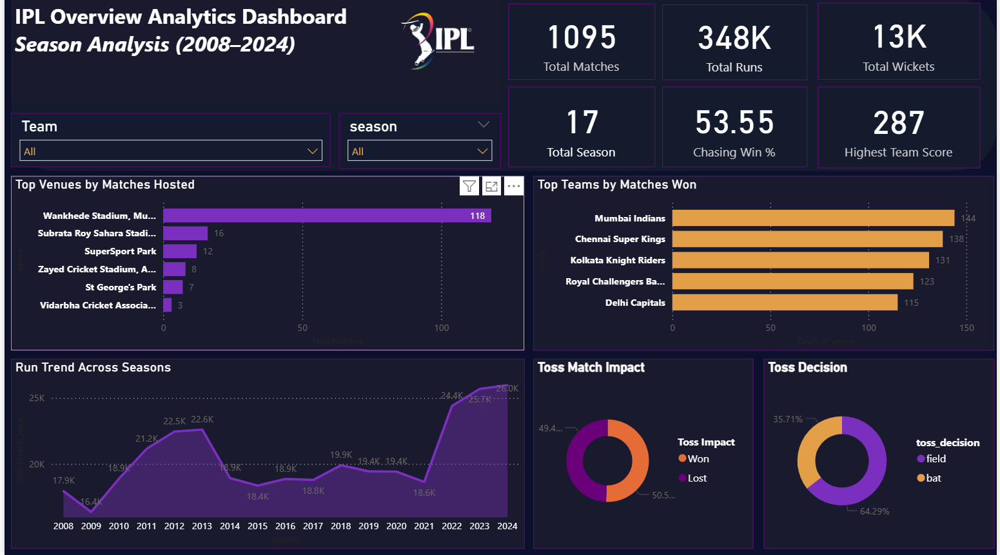
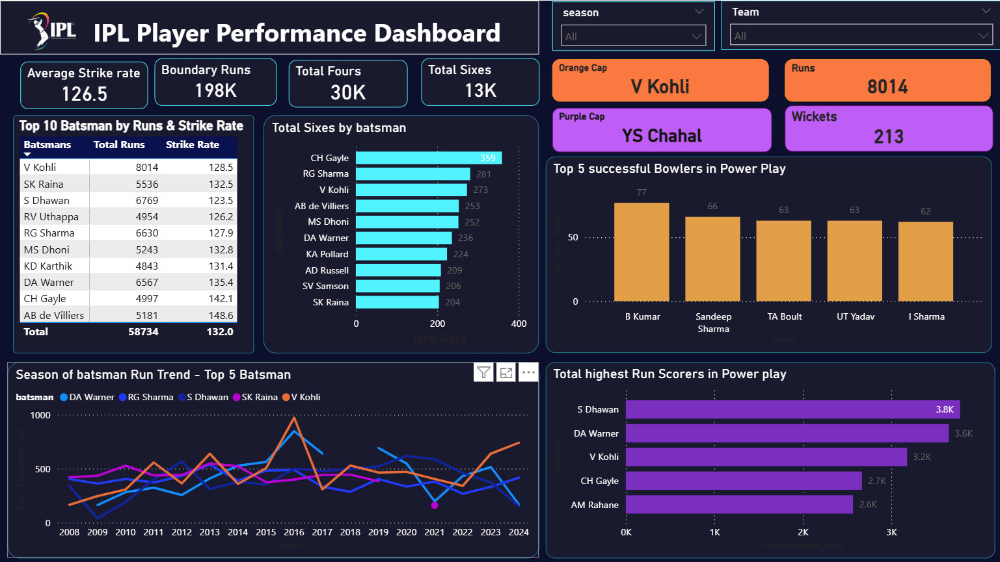
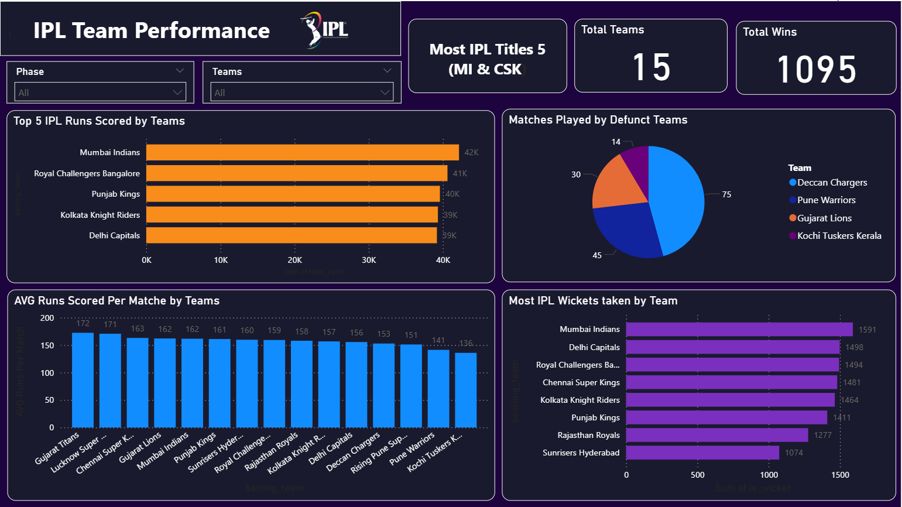

## 📌Project Overview

An end-to-end data analytics project on the Indian Premier League (IPL) dataset covering 17 seasons (2008–2024). This project demonstrates a complete data analyst workflow — from raw data cleaning in MySQL to interactive dashboard development in Power BI.
>"Transforming 200,000+ ball-by-ball records into actionable cricket insights."
----------------------------------------------------------------------
## 🎯Problem Statement

The Indian Premier League generates a massive volume of match and ball-by-ball data every season. Raw datasets alone do not provide meaningful insights for performance evaluation or strategic decision-making.
This project transforms raw IPL data into an interactive Intelligence dashboard that enables users to:
-	Analyze team and player performance across multiple seasons
-	Compare batting and bowling metrics using KPIs
-	Evaluate venue-wise and season-wise performance trends
-	Identify the impact of toss decisions and match-winning patterns
---------------------------------------------------------------------------
## 🛠️Tech Stack

| Category | Technology |
|---------|-----------|
| Database	| MySQL 8.0 |
| Data Preparation | Microsoft Excel |
|
| Data Transformation |	Power Query |
| Business Intelligence |	Power BI Desktop |
| Data Modeling	| DAX (Data Analysis Expressions)|
| Version Control |	Git & GitHub |
------------------------------------------------------------------
## 📂Dataset Overview
| Dataset |	Description |
|----------|------------|
| matches_clean.csv	| Match-level data — teams, venue, toss, winner, season, Player of Match
| deliveries_clean.csv |	Ball-by-ball data — batting, bowling, runs, wickets, extras
-	Time Period: 2008–2024
-	Source: Kaggle IPL Dataset
-	Total Matches: 1,095
-	Total Deliveries: 200,000+
------------------------------------------------------------------
## 📊Dashboard Preview
### 🔷 Dashboard 1 — IPL Overview Analysis

 
**Objective:** Provide a high-level overview of IPL performance from 2008–2024 by analyzing matches, runs, wickets, venues, toss impact, and season-wise trends.

**Key Insights:**
-	A total of 1,095 matches were played across 17 IPL seasons
-	More than 348K runs and 13K wickets were recorded
-	Mumbai Indians emerged as the team with the highest number of match wins
-	Teams chose to field first in the majority of matches — preference for chasing
-	Overall chasing success rate remained above 53%
-	Run scoring has generally increased in recent IPL seasons
--------------------------------------------------------------------
### 🔷 Dashboard 2 — Player Performance Analysis

 
**Objective:** Analyze batting and bowling performances to identify the most consistent and impactful IPL players.
**Key Insights:**
-	Virat Kohli holds the highest career run tally — 8,014 runs (Orange Cap)
-	Yuzvendra Chahal leads the wicket charts — 213 wickets (Purple Cap)
-	Chris Gayle recorded the highest number of career sixes
-	AB de Villiers holds the highest strike rate among top batters — 148.58
-	Boundary statistics indicate modern IPL batting relies heavily on power hitting
------------------------------------------------------------------------
### 🔷 Dashboard 3 — Team Performance Analysis
 
Objective: Evaluate team performance by comparing titles, runs scored, wickets taken, and average scoring across IPL franchises.
Key Insights:
-	Mumbai Indians and Chennai Super Kings are joint most successful — 5 IPL titles each
-	Mumbai Indians recorded the highest cumulative team runs
-	Gujarat Titans achieved the highest average runs per match
-	Mumbai Indians also lead in total wickets taken
------------------------------------------------------------------------
⚡ Key Performance Indicators
| KPI |	Value |
🟠 Orange Cap (All-Time)	V Kohli — 8,014 Runs
🟣 Purple Cap (All-Time)	YS Chahal — 213 Wickets
🏆 Most MOM Awards	AB de Villiers — 25 Awards
🏏 Highest Team Score	287 Runs
📈 Chasing Win %	53.55%
🏅 Most Successful Team	Mumbai Indians
⚡ Highest Strike Rate	AB de Villiers — 148.58
🎯 Total Boundaries	198K+
------------------------------------------------------------
## 🗄️ SQL Analysis Highlights
### SQL Analysis 1 — Run Distribution Across Innings Phases
Question: How are runs distributed across Powerplay, Middle Overs, and Death Overs?
 

Key Findings
-	Middle Overs contributed the highest total runs (154,288).
-	Powerplay recorded 118,056 runs, providing a strong scoring foundation.
-	Death Overs produced 75,412 runs, reflecting aggressive scoring in the final overs.
-	The Middle Overs played the most significant role in overall run accumulation.
-------------------------------------------------------
SQL Analysis 2 — Highest Successful Run Chases
Question: Which teams have achieved the highest successful run chases in IPL history?
 
Key Findings
-	Punjab Kings completed the highest successful chase of 262 runs.
-	Rajasthan Royals successfully chased 224 runs on multiple occasions.
-	Mumbai Indians and Sunrisers Hyderabad also feature among the highest successful run chases.
-	Successful chases above 200 runs demonstrate strong batting depth and effective pressure handling.
-------------------------------------------------
## 📁 Project Structure
'''text
IPL-Data-Analysis-Project/
│
├── 📁 Data/
│   ├── deliveries_clean.csv      # Ball-by-ball data (200K+ rows)
│   └── matches_clean.csv         # Match-level data (1,095 rows)
│
├── 📁 Images/
│   ├── IPL_Overview_Analysis.png # Season Overview Dashboard
│   ├── Player_Analysis.png       # Player Analysis Dashboard
│   └── Team_Analysis.png         # Team Analysis Dashboard
│
├── 📁 Power BI/
│   └──  IPL_Performance.pbix   # Interactive Power BI Dashboard
│
├── 📁 SQL/
│   ├── 01_Data_Cleaning.mysql.sql
│   ├── 02_Exploratory_Analysis.mysql.sql
│   └── 03_Analysis.mysql.sql
│
└── README.md
'''
-----------------------------------------------------
## 🚀 How to Run
MySQL:
1.	Install MySQL Workbench 8.0
2.	Create database: CREATE DATABASE ipl_project;
3.	Import CSV files from Data/ folder
4.	Run SQL files in order: 01 → 02 → 03
Power BI:
1.	Install Power BI Desktop
2.	Open Power BI/ IPL_Performance.pbix
3.	Update data source to your MySQL connection
4.	Click Refresh
-----------------------------------------------
## 📚 Project Learnings
-	Improved SQL querying skills using JOINs, aggregations, subqueries, and CASE statements
-	Built interactive dashboards using Power BI with 15+ DAX measures
-	Applied data cleaning and transformation using Power Query
-	Converted raw cricket data into meaningful analytical insights
-	Practiced end-to-end data analyst workflow
---------------------------------------------
## 👤 Author
**Aman Sen**
B.Com Graduate | Aspiring Data Analyst | Nagpur
Linkdin - https://www.linkedin.com/in/aman-sen-a917a7284/

-----------------------------------------

 
⭐ If you found this project helpful, please give it a star! ⭐

